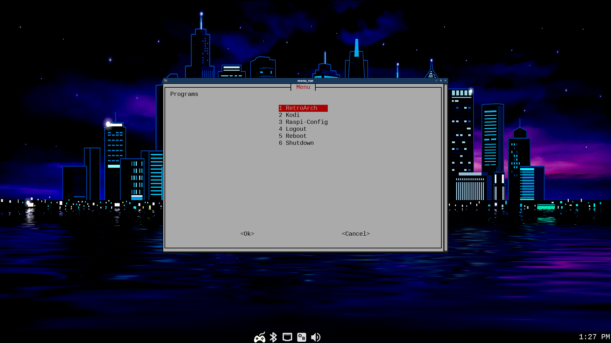

# raspberry-pi-tv

## Desctiption
I wanted to be able to switch between [RetroArch](https://www.retroarch.com/) and [Kodi](https://kodi.tv/) and utilize the latest [RaspiOS Lite](https://www.raspberrypi.com/software/) to run other services like hooking up a webcam and running [mjpg-streamer](https://github.com/jacksonliam/mjpg-streamer) when I'm not using the machine. I also want to be able to control the whole system with an [8BitDo Pro 2 Bluetooth Controller](https://www.8bitdo.com/pro2/) after it's initially configured. All I can find are single operating systems that accomplish these tasks individually. [LibreElec](https://libreelec.tv/) almost allows for both Kodi and emulation, but I couldn't get the controller mapped to play games and there's no room for expansion for the webcam or other services like with RaspiOS. [RetroPie](https://retropie.org.uk/) comes close, but it outdated and slow, but still very functional. I only use two emulators and don't want to run Emulation Station so it's a little too much for my use case. When left with individual operating systems, this means you'd have to swap cards or dual boot. Neither of which sound appealing when all of these tasks can be accomplished in the same base operating system. I used the [Epilogue GB Operator](https://www.epilogue.co/product/gb-operator) to obtain my GameBoy collection.



## Installation

Flash an SD card with RaspiOS Lite. Login and run the following. The first step of the script is to run ```raspi-config``` in which you should set up Autologin to Console and any other preferred settings that weren't chosen in Imager. *When asked to reboot select NO*

```
curl -O https://raw.githubusercontent.com/shansou504/raspberry-pi-tv/main/install.sh
chmod 755 install.sh
./install.sh
rm install.sh
sudo systemctl reboot
```

## Configuration

After the reboot, configure the following:

- openbox (custom keyboard bindings)
- obconf (window theme for openbox -> Nightmare 2)
- lxappearance (gtk theme -> Adwaita-dark / icon theme -> Papirus-dark)
- blueman-applet (pair, trust, connect game controller)
- antimicrox (setup keyboard and mouse bindings to game controller to run in openbox *make sure to name the file **controller1***)
- raspi-config (enable splash screen)
- pasystray (set default sink to preferred output)
- onboard (set at bottom of screen, start hidden, blackboard theme)
- retroarch (put roms in ~/roms/)

```
chmod 644 ~/.config/antimicrox/profiles/controller1.gamecontroller.amgp
```

## Usage

Openbox should autostart, your controller should automatically connect, the menu should load and you should be able to make selections with the gamepad.
